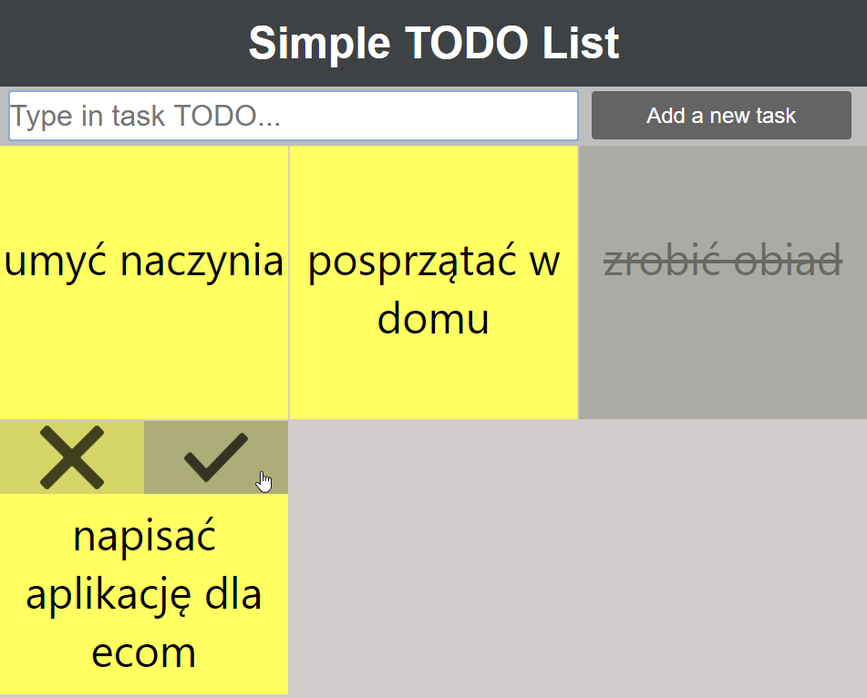

## Zgłoszenie Letnia Szkoła Programowania ecom 2019

Zadanie do wykonania w technologii React (z TypeScript), podpunkt *Ekstra* jest dodatkowy.

**1. TODO List**

Prosta aplikacja pozwalająca dodawać zadania do wykonania.
-	Użytkownik aplikacji może dodać nowe zadanie.
-	Zadania wyświetlane są w postaci kafli.
-	Użytkownik ma możliwość oznaczenia zadania jako wykonane - takie zadanie powinno być specjalnie wyróżnione, np. innym kolorem.

*Ekstra*: przechowywanie zadań - zadania widoczne są po odświeżeniu strony lub po ponownym wejściu na stronę.

### Komentarz z wykonania

Funkcjonalność zadanej aplikacji została rozszerzona o możliwość usuwania zadań oraz przywracania im statusu - zadania niewykonanego.

#### Prezentacja aplikacji

https://ddavid09.github.io/TODO-list-react-typescript/

---

